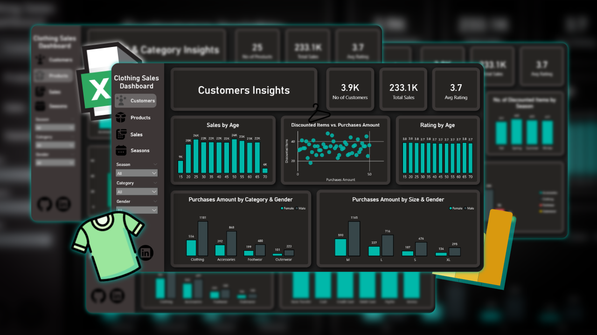
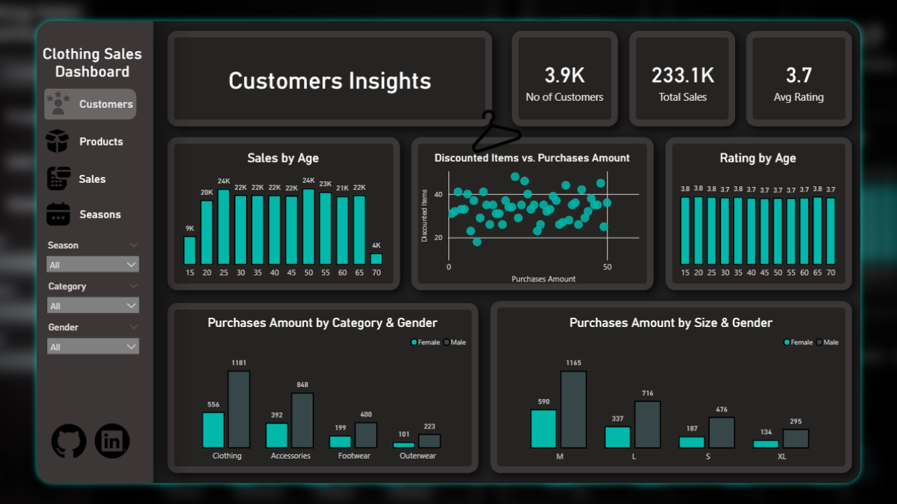
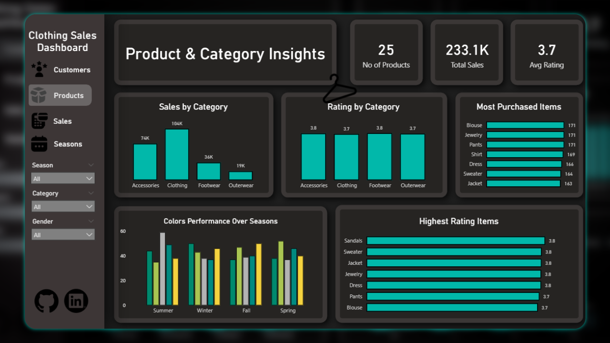
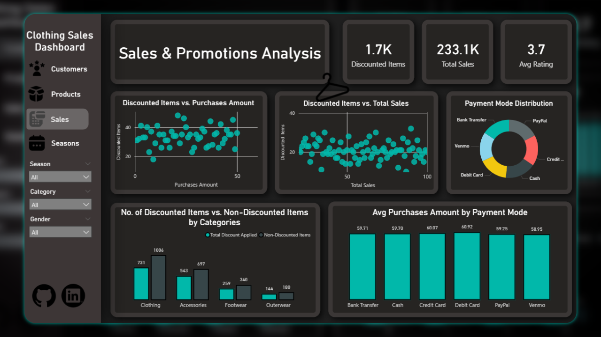
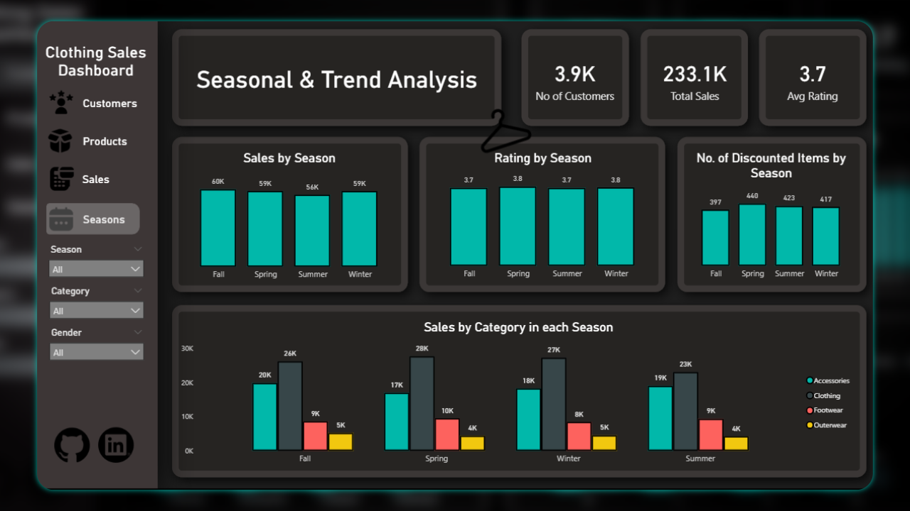

# Clothing Sales Analysis Dashboard

This project is a comprehensive sales dashboard built using Power BI to analyze customer behavior, product performance, and seasonal trends. The UI was designed in Figma, and complex analysis was performed using DAX.

## Dashboard Preview

---

## Project Overview

The primary objective of this project is to analyze historical sales data to uncover key insights into business performance.

The dashboard features a clean, dark-mode user interface, which was prototyped and designed in **Figma** to ensure an intuitive and visually appealing user experience. Advanced calculations, custom measures, and key performance indicators (KPIs) were developed using **DAX (Data Analysis Expressions)** to provide deep, actionable insights.

---

## Dashboard Features & Insights

The report is segmented into four main analysis pages:

### 1. Customer Insights

This page analyzes the customer base by demographics and purchasing behavior.
* **Key Metrics:** Total Customers (3.9K), Total Sales (233.1K), Avg Rating (3.7).
* **Visualizations:**
    * **Sales & Rating by Age:** Bar charts showing sales and average ratings distributed across different age groups.
    * **Purchases by Category & Gender:** A breakdown of spending by males and females across categories.
    * **Purchases by Size & Gender:** An analysis of which sizes are most popular among different genders.
    * **Discounted Items vs. Purchases:** A scatter plot to identify correlations between promotions and purchase amounts.

### 2. Product & Category Insights

This page focuses on product-level performance and category analysis.
* **Key Metrics:** No of Products (25), Total Sales (233.1K), Avg Rating (3.7).
* **Visualizations:**
    * **Sales by Category:** Clothing (104K) is the top-performing category, followed by Accessories (74K).
    * **Most Purchased Items:** Identifies top-selling items like Blouses, Jewelry, and Pants.
    * **Highest Rating Items:** Highlights products with the best customer ratings, such as Sandals, Sweaters, and Jackets (all 3.8).
    * **Colors Performance Over Seasons:** A grouped bar chart tracking the popularity of different colors throughout the year.

### 3. Sales & Promotions Analysis

This page dives into transactional data and the impact of discounts.
* **Key Metrics:** Discounted Items (1.7K), Total Sales (233.1K), Avg Rating (3.7).
* **Visualizations:**
    * **Payment Mode Distribution:** A donut chart showing PayPal and Credit Card as popular payment methods.
    * **Avg Purchases by Payment Mode:** A bar chart comparing the average transaction value for each payment type.
    * **Discounted vs. Non-Discounted Items:** A stacked bar chart showing the ratio of discounted items sold within each category.
    * **Discount Analysis:** Scatter plots correlating discounted items with purchase amounts and total sales.

### 4. Seasonal & Trend Analysis

This page tracks performance across different seasons to identify temporal patterns.
* **Key Metrics:** No of Customers (3.9K), Total Sales (233.1K), Avg Rating (3.7).
* **Visualizations:**
    * **Sales by Season:** Shows relatively balanced sales across Fall (60K), Spring (59K), Summer (56K), and Winter (59K).
    * **Discounted Items by Season:** Spring (440) and Summer (423) have the highest number of discounted items.
    * **Sales by Category in each Season:** A detailed breakdown of which categories perform best in each season.

---

## Tech Stack & Tools

* **Data Visualization & BI:** Microsoft Power BI
* **UI Design & Prototyping:** Figma
* **Data Analysis & Modeling:** DAX (Data Analysis Expressions)

---

## Project Purpose

The goal of this dashboard is to empower business stakeholders (e.g., Sales Managers, Marketing Teams, Inventory Planners) with a consolidated, interactive tool. By using the filters for **Season**, **Category**, and **Gender**, users can drill down into the data to:
* Identify top-performing products and categories.
* Understand the most valuable customer segments.
* Optimize marketing campaigns and promotional strategies.
* Make data-driven decisions for inventory management based on seasonal trends.

  ---

## 📬 Connect With Me

I'd love to connect! Feel free to reach out to me on LinkedIn for any questions, feedback, or potential collaborations.

